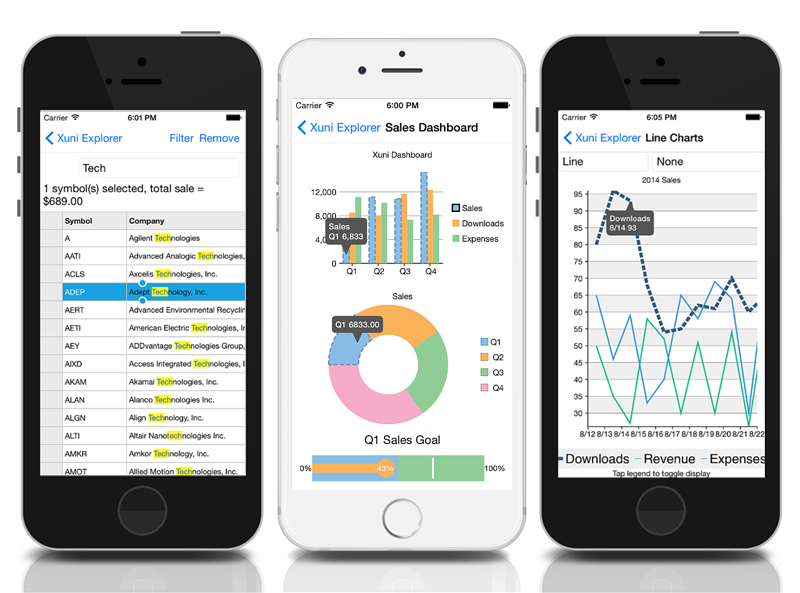

iOS Samples
=====================

These samples show how to use all features of Xuni controls in Universal iOS apps. Included in this repository are samples in Objective C and Swift. The samples do not contain the control libraries themselves. The controls can be downloaded from http://www.goxuni.com.

